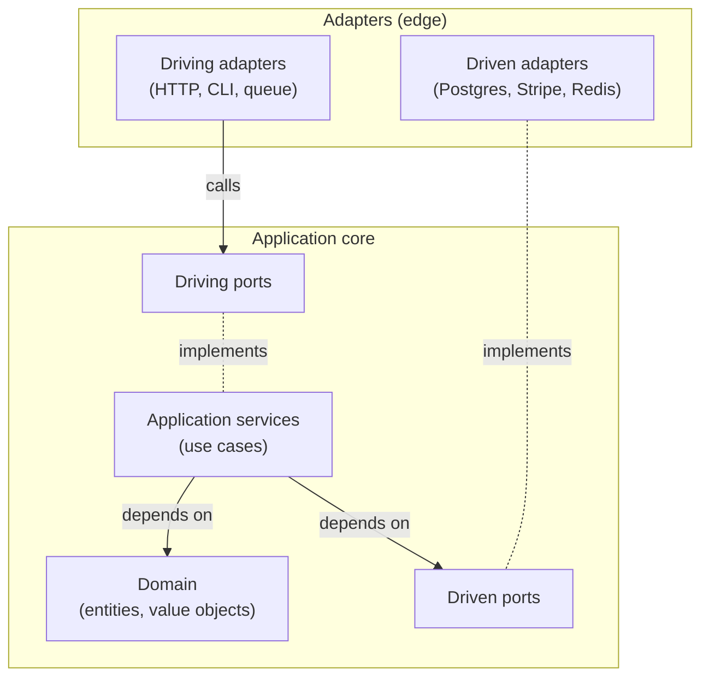

# Hexagonal Architecture — Port-Based Design

Reference for designing and reviewing services that follow hexagonal (ports & adapters) architecture. Designed to be consumed by both humans and AI agents. Rules are stated in imperative form so they are unambiguous when used as validation criteria.

Examples are given in **Go** and **Python**. The rules apply to other languages by analogy.

The document is organized as: **principles → vocabulary → stage gradient → dependency rule → layers → port rules → adapter rules → cross-cutting concerns → operational concerns → running example → testing → anti-patterns → review checklists**. When two rules appear to conflict, the rule that appears earlier in the document wins.

**How to read this document.** The patterns in §5–§12 are calibrated to a project's stage (§3). The default at every level is the **least machinery that works**; richer machinery is promoted when a documented trigger fires (§3.4). Skipping §3 and applying every rule as mandatory produces ceremony at POC stage and is the failure mode this document is designed to prevent.

---

## 1. Core Principles

1. **Dependencies point inward.** Adapters depend on ports; ports and application services depend on the domain; the domain depends on nothing outside the language's standard library. An `import` that violates this rule is a defect.
2. **Ports are owned by the feature.** A port lives next to the use case that needs it. The adapter implements the port; the port never references the adapter.
3. **The domain is pure.** Domain code MUST NOT import frameworks, drivers, HTTP clients, ORMs, loggers, or clocks. If the domain needs a clock, it asks for a `Clock` port.
4. **Adapters are the only place external types are allowed.** SQL rows, HTTP responses, Protobuf messages, S3 objects — all stop at the adapter boundary.
5. **One place knows everyone: the composition root.** Wiring (which adapter implements which port) happens once, in `main()` (Go) or a top-level bootstrap module (Python). Nothing else may import every concrete type.
6. **Testability is a consequence, not a goal.** If a layer is hard to test, the rules above are being broken. Fix the design, not the test.
7. **Stage gates the prescriptions.** Every pattern in this document is calibrated to a stage (§3). The default is the least machinery that works; promote to richer machinery only when a documented trigger fires. Adding patterns without a trigger is ceremony.

---

## 2. Vocabulary

| Term | Definition |
| --- | --- |
| **Domain** | Entities, value objects, domain services. The business rules. Pure. |
| **Application service** | A use case — orchestrates domain logic and calls driven ports. One per business operation. |
| **Driving port** (a.k.a. primary, inbound) | The interface the outside world uses to ask the application to do something. Often the application service itself is the port (its method set is the port's signature) until promoted (§3.4). |
| **Driven port** (a.k.a. secondary, outbound) | The interface the application uses to ask the outside world for something (a database, an external API, the clock). |
| **Driving adapter** | Adapts a real-world input (HTTP, CLI, queue consumer) into a call on a driving port. |
| **Driven adapter** | Adapts a driven port to a concrete external system (Postgres, Stripe, Redis). |
| **Composition root** | The single place that constructs adapters and injects them into application services. |
| **Feature package** | The package that holds everything for one business feature: model, ports, use cases, adapters. The recommended unit of organization (see §10). |
| **Port-owned type** | A type defined alongside the port and used as its input or return value. Not a framework type. |
| **Contract test** | A test that asserts a port's behavior, runnable against every adapter that implements it. |
| **Stage** | One of POC, early production, scaling. Determines which prescriptions in this document are mandatory vs. deferred (§3). |
| **Promotion trigger** | A documented condition under which an optional pattern becomes mandatory (§3.4). |
| **Cross-cutting concern** | A capability that touches every feature (logging, tracing, auth, tenancy, audit). Lives in its own small package (§8). |

---

## 3. Stage Gradient

Stage is a property of a project, not of an engineer. Three stages, each inheriting the prior's mandates.

### 3.1 POC

Solo or pair, pre-real-users, learning the domain. **Dominant risk: ceremony delaying first running code.**

**Mandatory:**
- §4 dependency rule
- §6 port design rules
- §7 adapter design rules
- §9.2 migrations applied locally and rehearsed before any deploy
- §9.4 typed configuration loaded at startup
- At least one integration test (testcontainers Postgres) per feature

**Deferred (introduce only on a §3.4 trigger):**
- Named driving-port interface (`UserRegistrar`) — until a second driving adapter needs the use case
- In-memory adapter fakes — until measured test latency or state-determinism forces it
- Cross-port contract test suites — until a second production adapter implements the port
- Per-feature sqlc outputs — until ≥3 features exist OR a feature is within one quarter of extraction
- `Clock` / `IDGenerator` ports — until a test depends on deterministic time/IDs
- `UnitOfWork` / explicit-tx cross-feature pattern — until a use case must atomically write across features
- Read-model / CQRS — never at this stage
- Caching, read replicas, circuit breakers — never at this stage

**Default test surface** is the real Postgres adapter via a session-scoped testcontainers pool. In-memory fakes are an optional optimization, not the default (§11.2).

### 3.2 Early Production

Real users (≤ thousands), single deployable, team ≤ 4. **Dominant risk: operational pain — the first incident must be debuggable.**

**Becomes mandatory (additional to POC):**
- §9.1 structured `Logger` port with correlation-ID propagation
- §9.1 health (`/healthz`) and readiness (`/readyz`) endpoints
- §9.2 migration workflow defined; expand/contract for any non-additive schema change
- §9.3 idempotency keys on every command that may be retried by a client or queue
- §9.5 slow-query tripwire on the Postgres adapter
- §11.4 adapter integration tests for every adapter, run on every PR

**Still deferred:**
- Per-feature sqlc split — same trigger as POC
- Contract test suites — same trigger as POC
- Tracing, read replicas, caching ports, CQRS — only when measurement demands them

### 3.3 Scaling

Multiple teams (or a clear roadmap there), high traffic, or imminent service extraction. **Dominant risk: ownership and runtime cost.**

**Becomes mandatory (additional to early production):**
- Per-feature sqlc outputs (§10.2 layout)
- §9.1 `Tracer` port (OpenTelemetry) and `Metrics` port
- §9.5 per-endpoint latency budgets asserted in CI via load test
- §10.4 cross-feature transaction pattern chosen and documented in §10.4 itself
- §11.3 contract suite for every port with ≥2 production adapters
- Read-model feature for cross-feature reads that exceed an endpoint's query/latency budget

### 3.4 Promotion triggers — quick reference

If you add a pattern without a trigger row in this table, you are adding ceremony. Either document a new trigger row first, or do not add the pattern.

| Pattern | Trigger |
| --- | --- |
| Named driving-port interface (`UserRegistrar`) | A second driving adapter (CLI, queue consumer, second HTTP route group) needs the use case |
| In-memory adapter fake | Integration test latency >100ms per case AND use case does not depend on Postgres-specific behavior |
| Cross-port contract test suite | A second production adapter is introduced for the same port |
| `Clock` / `IDGenerator` port | First test depends on deterministic time/IDs |
| Per-feature sqlc output | ≥3 features OR a feature is within one quarter of extraction to its own service |
| Cross-feature transaction pattern | First use case must atomically write across two features |
| Read-model feature | ≥2 endpoints share the join OR the join touches ≥3 features OR query budget exceeded |
| Caching port | Measured cache-hit opportunity OR a slow query is read-heavy and tolerates staleness |
| Read replica port (`UserReader`) | Measured read load saturates the primary |
| Circuit breaker in an adapter | Repeated upstream failures cause cascading user-facing latency |
| `Tracer` port | Project enters scaling stage OR a debugging incident demonstrated tracing was needed |

---

## 4. The Dependency Rule



Each layer's permitted dependencies:

| Layer (role) | MAY depend on | MUST NOT depend on |
| --- | --- | --- |
| Domain | Stdlib only | Anything else |
| Driving ports | Domain | Application services' internals, adapters, frameworks |
| Driven ports | Domain | Application services' internals, adapters, frameworks |
| Application services | Domain, driving & driven ports | Adapters, frameworks |
| Driving adapters | Driving ports (or the concrete app service at POC, §5.3), domain types referenced in port signatures | Other adapters, application services' internals beyond the port |
| Driven adapters | Driven ports, domain types referenced in port signatures | Other adapters |
| Composition root | Everything | — |

**Layers are roles, not directories.** The table describes the *logical* role of each piece of code. The recommended physical organization is feature colocation: every role for one business feature lives in one package (§10). The dependency rule then applies *between files* in that package, even though they share a namespace.

### 4.1 Enforcing the rule

**Python — `import-linter`.** Contracts can forbid file-level imports within a package. Each feature gets two contracts: one forbidding adapter→core imports, one keeping the domain pure. Example for the `users` feature:

```toml
# .importlinter
[importlinter]
root_packages = ["users", "orders", "config", "logger"]

[[importlinter.contracts]]
name = "users: ports/service/model cannot import adapters"
type = "forbidden"
source_modules = ["users.ports", "users.service", "users.model"]
forbidden_modules = [
    "users.repository_postgres",
    "users.repository_inmem",
    "users.handler",
]

[[importlinter.contracts]]
name = "users: domain is pure"
type = "forbidden"
source_modules = ["users.model"]
forbidden_modules = [
    "users.ports", "users.service", "users.handler",
    "users.repository_postgres", "users.repository_inmem",
    "asyncpg", "starlette", "logger",
]
```

Run `lint-imports` in CI. A new feature copies the block, replacing `users` with the feature name.

**Go — pick one of two strategies, project-wide:**

- **Strategy A (single-package feature).** Every file in `internal/users/` may import any sibling. Internal layering is reviewer-enforced. Pair with naming discipline (`model.go`, `port.go`, `service.go`, `handler.go`, `repository_postgres.go`) and a `go-arch-lint` rule that forbids cross-feature imports between `internal/*` packages.

- **Strategy B (split feature).** Sub-packages: `internal/users/domain/`, `internal/users/app/`, `internal/users/adapter/postgres/`, etc. Each sub-package's exported surface is compiler-enforced. Pays directory sprawl for stronger guarantees.

**Default: Strategy A** at POC and early production. Promote a single feature to Strategy B when that feature reaches the §3.4 extraction trigger. Mixing both inside a project is allowed only during the migration window.

---

## 5. Layers

The snippets below are abridged. The full directory tree and the parts not shown here (HTTP driving adapter, in-memory fake for tests) appear in §10.

### 5.1 Domain

The domain layer holds entities, value objects, and pure domain services. It has no dependencies outside the language's standard library.

**Rules:**

- No `database/sql`, no `net/http`, no `time.Now()` calls, no logging, no env reads.
- Behavior lives on the entities. An anemic data class with all logic elsewhere is a smell.
- Construction must be validated. In **Go**, use a `NewX(...)` factory by convention. In **Python**, put validation in `__post_init__` (frozen dataclasses) or `__init__`.

```go
// Go: users/model.go
package users

type Email string

func (e Email) String() string { return string(e) }

type UserID string

func (id UserID) IsZero() bool { return id == "" }

type User struct {
    id    UserID
    email Email
}

func NewUser(id UserID, email Email) (*User, error) {
    if id.IsZero() {
        return nil, ErrInvalidUserID
    }
    return &User{id: id, email: email}, nil
}

func (u *User) ID() UserID   { return u.id }
func (u *User) Email() Email { return u.email }
```

```python
# Python: users/model.py
from dataclasses import dataclass


@dataclass(frozen=True)
class UserID:
    value: str

    def is_zero(self) -> bool:
        return self.value == ""


@dataclass(frozen=True)
class Email:
    value: str

    def __str__(self) -> str:
        return self.value


class InvalidUserID(Exception):
    pass


class EmailTaken(Exception):
    pass


@dataclass(frozen=True)
class User:
    id: UserID
    email: Email

    def __post_init__(self) -> None:
        if self.id.is_zero():
            raise InvalidUserID()
```

### 5.2 Application Services

An application service implements one use case. It orchestrates domain objects and calls driven ports. It receives its driven-port dependencies through constructor injection (Go: struct fields; Python: `__init__` arguments).

**Rules:**

- One application service per use case (`RegisterUser`, `CancelOrder`). Not one `UserService` with twelve methods.
- Application service signatures use domain or port-owned types — never framework types.
- Application services do NOT log infrastructure events (an HTTP 500 is the adapter's concern); they MAY emit domain events.
- Application services do NOT retry external I/O — retries belong to the driven adapter (§9.3).
- Transactions across one feature are repository-internal. Transactions across features use the project's chosen pattern (§10.4) — never a raw `*sql.Tx` argument.

```go
// Go: users/service.go
package users

type RegisterUser struct {
    repo UserRepository // driven port
}

func NewRegisterUser(repo UserRepository) *RegisterUser {
    return &RegisterUser{repo: repo}
}

func (uc *RegisterUser) Execute(ctx context.Context, cmd RegisterUserCommand) (*User, error) {
    existing, err := uc.repo.FindByEmail(ctx, cmd.Email)
    if err != nil {
        return nil, err
    }
    if existing != nil {
        return nil, ErrEmailTaken
    }
    user, err := NewUser(NewUserID(), cmd.Email)
    if err != nil {
        return nil, err
    }
    if err := uc.repo.Save(ctx, user); err != nil {
        return nil, err
    }
    return user, nil
}
```

Note: the field is named `repo` (not `users`) to avoid shadowing the enclosing package name `users`. The same rule applies in the composition root (§5.6).

```python
# Python: users/service.py
from uuid import uuid4

from .ports import UserRepository, RegisterUserCommand
from .model import User, UserID, EmailTaken


class RegisterUser:
    def __init__(self, repo: UserRepository) -> None:
        self._repo = repo

    async def execute(self, cmd: RegisterUserCommand) -> User:
        if await self._repo.find_by_email(cmd.email) is not None:
            raise EmailTaken()
        user = User(id=UserID(str(uuid4())), email=cmd.email)
        await self._repo.save(user)
        return user
```

Note: this example does not inject a `Clock`. Per §3.4, the `Clock` port is introduced when the first test needs deterministic time. Until then, the use case uses `uuid4()` / `time.Now()` directly. Promoting later is mechanical: add the port, add the parameter, replace the direct call.

### 5.3 Driving Ports

A driving port is the interface the outside world calls to drive a use case. **At POC and early production, driving adapters depend directly on the concrete application service.** The application service's method set IS the port's signature; no separate interface declaration is needed.

Promote to a named interface when a second driving adapter (CLI, queue consumer, second HTTP route group) needs the same use case. The adapters then depend on the interface; the application service satisfies it structurally (Python) or by declaration (Go).

```go
// Go: users/port.go — at POC, only the command type is exported
package users

type RegisterUserCommand struct {
    Email Email
}

// When promoted (per §3.4):
// type UserRegistrar interface {
//     Execute(ctx context.Context, cmd RegisterUserCommand) (*User, error)
// }
```

```python
# Python: users/ports.py — at POC, only the command type is exported here
from dataclasses import dataclass

from .model import Email


@dataclass
class RegisterUserCommand:
    email: Email


# When promoted (per §3.4):
# from typing import Protocol
# from .model import User
#
# class UserRegistrar(Protocol):
#     async def execute(self, cmd: RegisterUserCommand) -> User: ...
```

### 5.4 Driven Ports

A driven port describes a capability the application needs from the outside world. The port is named in business language (`UserRepository`, `EmailSender`), not technology language (`PostgresClient`, `SmtpClient`).

**Rules:**

- A port's methods take and return domain types or port-owned DTOs. Never `*sql.Rows`, never `*http.Response`, never `*pb.User`, never a sqlc-generated row type.
- A port describes ONE capability. If a port has methods that no caller uses together, split it.
- Ports accept `context.Context` (Go) or are `async` (Python). External I/O is always cancellable.
- Ports return domain-level errors (`ErrNotFound`, `ErrConflict`). Adapter-level errors are mapped at the adapter boundary.

```go
// Go: users/port.go (continued — driven ports, same file as the command above)
type UserRepository interface {
    FindByEmail(ctx context.Context, email Email) (*User, error) // (nil, nil) on miss
    Save(ctx context.Context, user *User) error
}
```

```python
# Python: users/ports.py (continued — driven ports, same file)
from typing import Optional, Protocol

from .model import User, Email


class UserRepository(Protocol):
    async def find_by_email(self, email: Email) -> Optional[User]: ...
    async def save(self, user: User) -> None: ...
```

`Clock` is not shown here. It is introduced when promoted (§3.4):

```python
# When promoted: clock/ports.py — cross-cutting (§8.1), not a feature-owned port
from datetime import datetime
from typing import Protocol


class Clock(Protocol):
    def now(self) -> datetime: ...
```

### 5.5 Adapters

An adapter implements ONE port and translates between port-owned types and external types.

**Rules:**

- One adapter file per port implementation (`users/repository_postgres.go`, `users/repository_inmem.go`).
- Adapter constructors take their dependencies (DB pool, HTTP client) — they do NOT read env vars or build their own clients.
- All external errors are mapped to domain errors at the boundary. Callers must never see `pgx.ErrNoRows` or HTTP status codes.
- An adapter MUST NOT call another adapter. Composition belongs in the application service or the composition root, never in chained adapters.
- **Code-generated persistence (sqlc, Prisma, etc.) starts as a single shared `db/` package.** At POC and early production, every feature's repository imports the same `db/` package and uses the query methods scoped to its tables. Promote to per-feature `db/` packages when the §3.4 trigger fires (≥3 features OR a feature is within one quarter of extraction). Generated types never escape the adapter regardless of which mode the project is in.

```go
// Go: internal/users/repository_postgres.go — early-production form (shared db/)
package users

import (
    "context"
    "errors"
    "fmt"

    "github.com/jackc/pgx/v5"
    "github.com/jackc/pgx/v5/pgxpool"

    "myapp/internal/db" // shared sqlc output (early production)
)

type PostgresUserRepository struct {
    q *db.Queries
}

func NewPostgresUserRepository(pool *pgxpool.Pool) *PostgresUserRepository {
    return &PostgresUserRepository{q: db.New(pool)}
}

func (r *PostgresUserRepository) FindByEmail(ctx context.Context, email Email) (*User, error) {
    row, err := r.q.GetUserByEmail(ctx, email.String())
    if err != nil {
        if errors.Is(err, pgx.ErrNoRows) {
            return nil, nil // miss
        }
        return nil, fmt.Errorf("postgres user repository find by email: %w", err)
    }
    return NewUser(UserID(row.UserID.String()), Email(row.Email))
}

func (r *PostgresUserRepository) Save(ctx context.Context, u *User) error {
    err := r.q.InsertUser(ctx, db.InsertUserParams{
        UserID: u.ID().String(),
        Email:  u.Email().String(),
    })
    if err != nil {
        if isUniqueViolation(err, "users_email_key") {
            return ErrEmailTaken
        }
        return fmt.Errorf("postgres user repository save: %w", err)
    }
    return nil
}
```

After promotion to per-feature outputs, the import becomes `myapp/internal/users/db` and the rest is unchanged. See §10.

```python
# Python: src/users/repository_postgres.py — early-production form
from typing import Optional

import asyncpg

from db import queries  # shared sqlc-gen-python output (early production)
from .model import User, UserID, Email, EmailTaken


class PostgresUserRepository:  # structurally satisfies users.ports.UserRepository
    def __init__(self, pool: asyncpg.Pool) -> None:
        self._pool = pool

    async def find_by_email(self, email: Email) -> Optional[User]:
        async with self._pool.acquire() as conn:
            row = await queries.AsyncQuerier(conn).get_user_by_email(email=str(email))
        if row is None:
            return None
        return User(id=UserID(str(row.user_id)), email=Email(row.email))

    async def save(self, user: User) -> None:
        try:
            async with self._pool.acquire() as conn:
                await queries.AsyncQuerier(conn).insert_user(
                    user_id=str(user.id), email=str(user.email),
                )
        except asyncpg.UniqueViolationError:
            raise EmailTaken()
```

### 5.6 Composition Root

The composition root is the only place that imports every feature package and every cross-cutting adapter. In Go it is `main.go` (or `cmd/<service>/main.go`). In Python it is `bootstrap.py` (or `container.py`) at the top of the application.

```go
// Go: cmd/api/main.go (early-production form)
package main

import (
    "context"
    "log"
    "net/http"

    "myapp/internal/config"
    "myapp/internal/logger"
    "myapp/internal/users"
)

func main() {
    ctx := context.Background()
    cfg := config.Load() // §9.4

    log := logger.NewSlog(cfg.LogLevel) // §9.1

    pool := must(pgxpool.New(ctx, cfg.PostgresDSN))

    userRepo := users.NewPostgresUserRepository(pool)
    registerUser := users.NewRegisterUser(userRepo)
    userHandler := users.NewRegisterUserHandler(registerUser, log)

    mux := http.NewServeMux()
    mux.Handle("POST /users", userHandler)
    mux.HandleFunc("GET /healthz", healthz)
    mux.HandleFunc("GET /readyz", readyz(pool))

    log.Info(ctx, "listening", logger.Field("addr", cfg.ListenAddr))
    log.Fatal(http.ListenAndServe(cfg.ListenAddr, mux))
}
```

```python
# Python: bootstrap.py (early-production form)
import asyncpg
from starlette.applications import Starlette

from config import Config
from logger import build_logger
from users.repository_postgres import PostgresUserRepository
from users.service import RegisterUser
from users.handler import register_user_route
from health.handler import health_routes


async def build_app(cfg: Config) -> Starlette:
    log = build_logger(cfg.log_level)  # §9.1
    pool = await asyncpg.create_pool(cfg.postgres_dsn)

    user_repo = PostgresUserRepository(pool)
    register_user = RegisterUser(repo=user_repo)

    return Starlette(routes=[
        register_user_route(register_user, log),
        *health_routes(pool),
    ])
```

---

## 6. Port Design Rules

1. **Small interfaces.** Each port states ONE capability. A `UserRepository` with `FindByEmail`, `Save`, `Delete` is fine if every caller uses two or more of those; if not, split into `UserFinder` and `UserWriter`.
2. **Port-owned types.** Inputs and outputs are domain types or DTOs defined alongside the port. Never `*sql.Rows`, `*http.Response`, `*pb.User`, or a sqlc-generated row type.
3. **Naming.** Use business names. `UserRepository`, not `UserDAO` or `IUserRepository`. Adapters carry a technology suffix or prefix: `PostgresUserRepository`, `RedisUserCache`, `InMemoryUserRepository`.
4. **Context and cancellation.** Go: first argument is `context.Context`. Python: `async def`.
5. **Error contracts.** Errors returned by a port are domain errors declared in the feature package. The port documents which errors callers must handle.
6. **Nil and absence.** Decide once, per project: `(*T, error)` with `(nil, nil)` for not-found, or `(*T, bool, error)`. Don't mix conventions across ports.
7. **No "and" methods.** A method called `CreateAndNotify` is two capabilities pretending to be one. Compose at the application-service layer instead.
8. **Idempotency belongs to the command type.** When a port promises at-least-once delivery, the command type carries an `IdempotencyKey` field; the adapter consults it to deduplicate (§9.3).

---

## 7. Adapter Design Rules

1. **One port per adapter.** An adapter that implements two unrelated ports is two adapters glued together.
2. **Map errors at the boundary.** `pgx.ErrNoRows`, `redis.Nil`, `404 Not Found` are translated to domain errors inside the adapter — they never escape it.
3. **No env reads, no config singletons.** Configuration arrives through the constructor. The composition root is the only place that touches `os.Getenv` / `os.environ`.
4. **No adapter-to-adapter calls.** If a use case needs both Postgres and SMTP, the application service orchestrates that — not a "service adapter" that wraps both.
5. **Logging is structured and infra-only.** Adapters log infrastructure events (slow query, retried HTTP request) through the `Logger` port (§9.1) with correlation IDs. Business-level logging belongs to the application service, if anywhere.
6. **Retries live in the adapter that owns the I/O.** The application service does NOT retry. The SMTP adapter retries SMTP; the HTTP client adapter retries HTTP. Retry budget is documented in the feature's README.
7. **Circuit breakers live in the adapter.** When open, the breaker surfaces a domain error (`ErrUpstreamUnavailable`), never a framework exception.
8. **Idempotency keys are honored by the adapter.** The application service generates and persists the key; the adapter uses it to deduplicate (§9.3).

---

## 8. Cross-Cutting Concerns

Patterns that touch every feature live outside any single feature, in their own small packages.

### 8.1 Infrastructure adapters

These have no business rules — they wrap a technical capability behind a port.

- `config/` — typed configuration loaded once at startup (§9.4)
- `logger/` — `Logger` port and concrete adapter (§9.1)
- `tracer/` — `Tracer` port (promoted at scaling, §3.4)
- `metrics/` — `Metrics` port (promoted at scaling, §3.4)
- `clock/` — `Clock` port (promoted on test-determinism need, §3.4)
- `idgen/` — `IDGenerator` port (promoted on test-determinism need, §3.4)
- `eventbus/` — `EventBus` port (when domain events cross feature boundaries)
- `health/` — health/readiness handlers (mandatory at early production, §9.1)

Each feature imports only the ones it uses. The composition root wires the concrete adapter for each.

### 8.2 Cross-cutting domain concerns (auth, tenancy, audit)

These are NOT infrastructure — they have business rules. Each gets its own feature package:

- `auth/` — `Principal` domain type, `PrincipalReader` driving port (consulted from middleware), `RequireRole` policy helper
- `tenancy/` — `TenantID` value object, middleware that extracts and propagates it
- `audit/` — `AuditLog` driven port, `AuditEvent` domain type, recorded by application services that mutate state

**Propagation:** the cross-cutting value flows through `context.Context` (Go) or contextvars (Python). Feature application services accept it as a parameter or read it from context — never via a global, never through direct imports of `auth.Principal` into another feature's model.

```python
# Python: tenancy/middleware.py
from starlette.middleware.base import BaseHTTPMiddleware
from .model import TenantID, tenant_id_var


class TenancyMiddleware(BaseHTTPMiddleware):
    async def dispatch(self, request, call_next):
        tid = TenantID(request.headers["x-tenant-id"])
        token = tenant_id_var.set(tid)
        try:
            return await call_next(request)
        finally:
            tenant_id_var.reset(token)


# Python: users/service.py — feature reads from contextvar at the seam
from tenancy.model import tenant_id_var

class RegisterUser:
    async def execute(self, cmd: RegisterUserCommand) -> User:
        tenant_id = tenant_id_var.get()
        ...
```

**Rule:** cross-cutting domain values cross feature boundaries through ports, middleware, or context — never through direct imports of another feature's domain types.

---

## 9. Operational Concerns

How the system runs, observed, deployed, and survives failure. Mandatory items below are pinned to a stage (§3); items without a stage are good practice and optional.

### 9.1 Observability ports

Observability is wired through driven ports, same as any other I/O.

**`Logger` port** (mandatory at early production). Structured fields, correlation IDs.

```go
// Go: logger/port.go
type Field struct {
    Key string
    Val any
}

type Logger interface {
    Info(ctx context.Context, msg string, fields ...Field)
    Warn(ctx context.Context, msg string, fields ...Field)
    Error(ctx context.Context, msg string, err error, fields ...Field)
}
```

```python
# Python: logger/port.py
from typing import Protocol


class Logger(Protocol):
    def info(self, msg: str, **fields: object) -> None: ...
    def warn(self, msg: str, **fields: object) -> None: ...
    def error(self, msg: str, *, exc: BaseException | None = None, **fields: object) -> None: ...
```

Concrete adapter: `slog` (Go), `structlog` (Python). The adapter pulls the correlation ID from `ctx` / contextvar and attaches it to every line.

**`Tracer` port** (mandatory at scaling). Span lifecycle.

```python
# Python: tracer/port.py
from contextlib import contextmanager
from typing import Iterator, Protocol


class Span(Protocol):
    def set_attribute(self, key: str, value: object) -> None: ...


class Tracer(Protocol):
    @contextmanager
    def span(self, name: str, **attrs: object) -> Iterator[Span]: ...
```

Concrete adapter: OpenTelemetry.

**`Metrics` port** (mandatory at scaling). Counters, histograms.

**Correlation IDs.** The HTTP driving adapter extracts `X-Request-ID` (or generates a UUID), puts it in context, and every downstream driven adapter logs it. This is the entire "trace incident across services" foundation; without it, the first production incident is debuggable only by lucky timestamps.

**Health endpoints** (mandatory at early production). A `health/` package with:

- `/healthz` (liveness) — always 200 if the process is up.
- `/readyz` (readiness) — checks DB pool can acquire a connection, plus each critical downstream. Returns 503 when any check fails.

### 9.2 Migrations

Schema changes are managed by a single tool, applied in one direction, and rehearsed before deploy.

**Tool.** `golang-migrate` or `atlas` (Go projects), `alembic` (Python projects). Pick one per project; document the choice in the project's README. **Do not mix.**

**Workflow:**

1. Write migration file (`NNN_<description>.up.sql`; `.down.sql` for local rollback only).
2. Apply locally: `migrate up`.
3. Regenerate sqlc.
4. Write or update the repository adapter.
5. PR includes: migration + regenerated sqlc + adapter change + test.
6. CI applies migrations against a fresh test DB and runs adapter integration tests.
7. Deploy applies migrations BEFORE rolling new application instances.

**Zero-downtime via expand/contract** — mandatory at early production for any non-additive schema change.

1. **Expand:** add new schema (column, table) without removing old. Deploy app that writes to both, reads from old. ✅ Ship.
2. **Backfill:** populate new schema from old in a background job or migration. Verify counts/checksums.
3. **Switch:** app reads from new, still writes both. ✅ Ship. Observe for one release cycle.
4. **Contract:** app writes to new only. Migration drops old column/table. ✅ Ship.

Each step is its own migration and its own deploy. Never collapse expand + contract into one migration.

**Rollback:** forward-only in production. `.down.sql` exists for local development. If a migration ships broken, the recovery is another migration, not a rollback.

### 9.3 Failure handling

**Idempotency.** Every command that can be retried by a client or queue includes an `IdempotencyKey` field on the command type. Choose ONE storage strategy per project:

- A dedicated `idempotency_keys` table the application service writes inside the same transaction as the business write. The key + a hash of the command stores the result; duplicates return the cached result.
- The business table itself with a `UNIQUE` constraint on the key column. The application service catches the unique-violation and fetches the existing row.

```python
# Python: users/ports.py — command carries the key
@dataclass
class RegisterUserCommand:
    email: Email
    idempotency_key: str
```

**Retries** belong to the adapter that owns the I/O. The application service does NOT retry; the SMTP adapter retries SMTP, the HTTP client adapter retries HTTP. Budget: documented per project (e.g. max 3 attempts, exponential backoff with jitter, total ≤ 5s per request). Document the budget in the adapter's source file as a comment.

**Circuit breakers** live in the driven adapter that calls an external system. Open state surfaces as a domain error (`ErrUpstreamUnavailable`) — not a framework exception. The application service maps that error to its use case's failure mode.

**Dead-letter queues.** Every queue-consumer driving adapter has a DLQ. Messages that fail N times move to the DLQ. The application service signals "do not retry, this is poisoned" by returning a specific domain error (`ErrPoisoned`); the consumer adapter sends to DLQ on that error. Other errors are retried up to the budget.

### 9.4 Configuration

A typed `Config` struct lives in `config/`. The composition root constructs it once at startup.

```python
# Python: config/__init__.py
import os
from dataclasses import dataclass


@dataclass(frozen=True)
class Config:
    postgres_dsn: str
    listen_addr: str
    log_level: str

    @classmethod
    def load(cls) -> "Config":
        return cls(
            postgres_dsn=_required("POSTGRES_DSN"),
            listen_addr=os.environ.get("LISTEN_ADDR", ":8080"),
            log_level=os.environ.get("LOG_LEVEL", "info"),
        )


def _required(key: str) -> str:
    val = os.environ.get(key)
    if not val:
        raise SystemExit(f"missing required env: {key}")
    return val
```

```go
// Go: internal/config/config.go
package config

type Config struct {
    PostgresDSN string
    ListenAddr  string
    LogLevel    string
}

func Load() Config {
    return Config{
        PostgresDSN: required("POSTGRES_DSN"),
        ListenAddr:  withDefault("LISTEN_ADDR", ":8080"),
        LogLevel:    withDefault("LOG_LEVEL", "info"),
    }
}
```

Validation happens in `Load()`. Missing required values fail startup, not first-request. Secrets resolve through the same loader (env / mounted file / secret-manager adapter behind the env var name).

### 9.5 Runtime scalability

**Connection pooling.** Every Postgres adapter receives a `*pgxpool.Pool` (Go) or `asyncpg.Pool` (Python). Pool sized to `(workers × concurrency_per_worker) + headroom`. The composition root owns sizing; it is part of `Config`.

**Slow-query tripwire** (mandatory at early production). The Postgres adapter wraps every query with a histogram metric (`db_query_duration_seconds{query=<name>}`). Queries exceeding the threshold (default 100ms) emit a warn log with the query identifier. The threshold is a config value.

**Read replicas.** When primary read load saturates: model the replica as a separate driven port (`UserReader` on the replica, `UserWriter` on the primary). Do NOT do connection-string trickery inside a single adapter. The composition root wires each port to its pool.

**Caching.** When introduced: a separately-named driven port (`UserCache`). The application service decides whether to consult cache, fall back to repository on miss, and write through on update. The cache port has its own contract test.

**Per-endpoint latency budgets** (mandatory at scaling). Each feature's README declares the budget for its endpoints. CI runs a load test that fails on p95 regression past the budget.

---

## 10. Running Example — Wiring `RegisterUser` end-to-end

Everything for one business feature lives in one package.

### 10.1 What is a feature?

A package qualifies as a feature when ALL of these hold:

- It owns an aggregate root (User, Order, Payment) with its own lifecycle.
- Its data is reachable via its own ID space (rows it owns have its IDs at the root).
- It could plausibly be extracted to its own service without rewriting its callers' core flows.
- It has a stable contract — the set of commands the rest of the system uses to drive it — that other features depend on by name, not by internals.

A package that doesn't meet all four is not a feature. It is one of:

- **Part of an existing feature** — move the files there.
- **A cross-cutting concern** — move to §8.
- **A read model serving multiple features** — promote per §10.4 cross-feature reads.

### 10.2 Layout — early production (shared sqlc)

```
cmd/api/main.go                       # composition root

database/
  schemas/                            # shared DDL — FKs cross features
  migrations/                         # versioned migrations (one tool, §9.2)
  sqlc.yaml                           # single `sql:` entry at this stage

internal/
  config/
    config.go
  logger/
    port.go
    slog.go                           # concrete adapter
  health/
    handler.go
  clock/                              # PROMOTED ONLY — absent until first test needs it

  db/                                 # sqlc OUTPUT — SHARED across features at this stage
    db.gen.go
    models.gen.go
    queries.gen.go

  users/
    model.go                          # User, UserID, Email, errors (domain)
    port.go                           # RegisterUserCommand + driven ports
    service.go                        # RegisterUser use case
    handler.go                        # HTTP driving adapter (depends on *RegisterUser)
    repository_postgres.go            # imports myapp/internal/db
    queries.sql                       # contributes to internal/db output

    model_test.go
    service_test.go                   # uses real Postgres via testcontainers (§11.2)
    repository_postgres_test.go

  orders/                             # mirror layout
    model.go
    port.go
    service.go
    handler.go
    repository_postgres.go
    queries.sql
```

`sqlc.yaml` at this stage:

```yaml
version: "2"
sql:
  - name: app
    engine: "postgresql"
    queries:
      - "internal/users/queries.sql"
      - "internal/orders/queries.sql"
    schema: "database/schemas"
    gen:
      go:
        package: "db"
        out: "internal/db"
        sql_package: "pgx/v5"
        output_files_suffix: ".gen.go"
```

### 10.3 Layout — scaling (per-feature sqlc, promoted)

When ≥3 features exist OR a feature is within one quarter of extraction (§3.4), split sqlc:

```
internal/
  users/
    ...
    queries.sql
    db/                               # sqlc OUTPUT — scoped to users
      db.gen.go
      models.gen.go
      queries.gen.go

  orders/
    ...
    queries.sql
    db/                               # separate sqlc OUTPUT for orders
      ...
```

`sqlc.yaml` after promotion has one `sql:` entry per feature, each writing into `internal/<feature>/db`. The repository in `users/repository_postgres.go` changes one import line (`myapp/internal/db` → `myapp/internal/users/db`); nothing else changes.

**Why split this way at scaling:** each feature owns its slice of the persistence layer. The composition root never imports any `db` sub-package; each feature takes a `*pgxpool.Pool` and constructs its own `*db.Queries` internally. Removing a feature means deleting its directory and one entry in `sqlc.yaml`.

**Python layout** mirrors the same shape. At early production, a single `src/db/` is shared. At scaling, each `src/<feature>/db/` is its own sqlc-gen-python output.

### 10.4 Cross-feature concerns

**Cross-feature reads (joins).** Resolve in this order:

1. **Two repository calls in the application layer.** Default at POC and early production. ✅ Use freely UNLESS the call site is in a loop OR per-request query count exceeds the endpoint's budget OR measured p95 latency exceeds the endpoint's budget — these are the §3.4 promotion triggers.
2. **Place the join in the feature that owns the FK.** Move here when option 1 trips a trigger. If `orders.user_id` references `users.user_id`, a `(order, user_email)` join belongs in `internal/orders/queries.sql`; `orders/db` will gain a row type that includes user fields. Acceptable when there is a real FK relationship.
3. **A dedicated read-model feature** (e.g. `reporting/`) with its own queries and (at scaling) its own `db/` package. Move here when ≥2 endpoints share the join OR the join touches ≥3 features.

**Cross-feature writes (transactions).**

At POC and early production with no use case crossing features: **nothing to decide.** Each repository takes the pool and runs its own short transactions. Do not pre-pick a cross-feature pattern.

When the first use case must atomically write across two features: pick ONE pattern, document the choice in this section of *this document*, apply to all future cross-feature transactions. Once chosen, mixing patterns is an anti-pattern (§12).

Two patterns are available. Their details live in Appendix A; promote the chosen one into this section when you make the choice.

- **Explicit transaction passing** — each feature's repository exposes a `WithTx(tx)` constructor; the cross-feature app service begins the tx and constructs tx-bound repositories.
- **`UnitOfWork` driven port** — a cross-cutting `uow` package; each repository checks context for an active tx and uses it via `WithTx` if present.

### 10.5 The driving adapter — HTTP (no premature interface)

At POC and early production the handler depends on the concrete application service. No `UserRegistrar` interface yet.

```go
// Go: users/handler.go
package users

type RegisterUserHandler struct {
    uc  *RegisterUser
    log logger.Logger
}

func NewRegisterUserHandler(uc *RegisterUser, log logger.Logger) *RegisterUserHandler {
    return &RegisterUserHandler{uc: uc, log: log}
}

func (h *RegisterUserHandler) ServeHTTP(w http.ResponseWriter, r *http.Request) {
    var body struct {
        Email          string `json:"email"`
        IdempotencyKey string `json:"idempotency_key"`
    }
    if err := json.NewDecoder(r.Body).Decode(&body); err != nil {
        http.Error(w, "invalid body", http.StatusBadRequest)
        return
    }
    user, err := h.uc.Execute(r.Context(), RegisterUserCommand{
        Email:          Email(body.Email),
        IdempotencyKey: body.IdempotencyKey,
    })
    switch {
    case errors.Is(err, ErrEmailTaken):
        http.Error(w, "email taken", http.StatusConflict)
    case err != nil:
        h.log.Error(r.Context(), "register user failed", err)
        http.Error(w, "internal", http.StatusInternalServerError)
    default:
        _ = json.NewEncoder(w).Encode(map[string]string{"user_id": string(user.ID())})
    }
}
```

```python
# Python: users/handler.py
from starlette.responses import JSONResponse
from starlette.routing import Route

from logger.port import Logger
from .model import Email, EmailTaken
from .ports import RegisterUserCommand
from .service import RegisterUser


def register_user_route(uc: RegisterUser, log: Logger) -> Route:
    async def handler(request):
        body = await request.json()
        try:
            user = await uc.execute(RegisterUserCommand(
                email=Email(body["email"]),
                idempotency_key=body["idempotency_key"],
            ))
        except EmailTaken:
            return JSONResponse({"error": "email taken"}, status_code=409)
        except Exception as exc:
            log.error("register user failed", exc=exc)
            return JSONResponse({"error": "internal"}, status_code=500)
        return JSONResponse({"user_id": str(user.id)})

    return Route("/users", handler, methods=["POST"])
```

When the same use case needs a second driving adapter — CLI, queue consumer, gRPC handler — extract the `UserRegistrar` interface per §5.3, change the handler's field type, done.

### 10.6 The in-memory fake — promoted only

The in-memory fake is NOT created by default. Per §3.4, introduce it only when a measured test slowness or determinism need forces it. When introduced, write the contract test (§11.3) first so the fake stays aligned with the Postgres adapter.

```go
// Go: users/repository_inmem.go — exists only after promotion
package users

type InMemoryUserRepository struct {
    mu      sync.Mutex
    byEmail map[string]*User
}

func NewInMemoryUserRepository() *InMemoryUserRepository {
    return &InMemoryUserRepository{byEmail: map[string]*User{}}
}

func (r *InMemoryUserRepository) FindByEmail(_ context.Context, email Email) (*User, error) {
    r.mu.Lock()
    defer r.mu.Unlock()
    return r.byEmail[email.String()], nil
}

func (r *InMemoryUserRepository) Save(_ context.Context, u *User) error {
    r.mu.Lock()
    defer r.mu.Unlock()
    if _, exists := r.byEmail[u.Email().String()]; exists {
        return ErrEmailTaken
    }
    r.byEmail[u.Email().String()] = u
    return nil
}
```

---

## 11. Testing Strategy

Tests live next to the code they exercise.

**Default test surface for application services: the real Postgres adapter via testcontainers** (§11.4). In-memory fakes are an optional optimization, promoted only when measured slowness or determinism demands it (§3.4). The argument for this default: most production bugs in a Postgres-backed service are NULL handling, FK violations, transaction isolation, and sqlc-generated nullable mapping — none of which reproduce in a hand-written fake.

### 11.1 Domain tests — pure

Domain tests need no fakes. Construct entities directly and assert behavior.

```go
// Go: users/model_test.go
func TestUser_RejectsZeroID(t *testing.T) {
    t.Parallel()
    _, err := NewUser(UserID(""), Email("a@b.com"))
    if !errors.Is(err, ErrInvalidUserID) {
        t.Fatalf("expected ErrInvalidUserID, got %v", err)
    }
}
```

```python
# Python: users/test_model.py
def test_user_rejects_zero_id():
    with pytest.raises(InvalidUserID):
        User(id=UserID(""), email=Email("a@b.com"))
```

### 11.2 Application service tests — against Postgres testcontainers (default)

```python
# Python: users/test_service.py
import pytest
from uuid import uuid4

from .model import User, UserID, Email, EmailTaken
from .ports import RegisterUserCommand
from .repository_postgres import PostgresUserRepository
from .service import RegisterUser


@pytest.mark.parametrize("seed_emails, cmd_email, expected_error", [
    ([], "a@b.com", None),
    (["a@b.com"], "a@b.com", EmailTaken),
])
async def test_register_user(postgres_pool, truncate_users, seed_emails, cmd_email, expected_error):
    repo = PostgresUserRepository(postgres_pool)
    for e in seed_emails:
        await repo.save(User(id=UserID(str(uuid4())), email=Email(e)))
    uc = RegisterUser(repo=repo)
    if expected_error:
        with pytest.raises(expected_error):
            await uc.execute(RegisterUserCommand(email=Email(cmd_email), idempotency_key=str(uuid4())))
    else:
        await uc.execute(RegisterUserCommand(email=Email(cmd_email), idempotency_key=str(uuid4())))
```

`postgres_pool` is session-scoped (§11.4). `truncate_users` is per-test, truncating tables this test touches.

```go
// Go: users/service_test.go
func TestRegisterUser(t *testing.T) {
    cases := []struct {
        name    string
        seed    []*User
        cmd     RegisterUserCommand
        wantErr error
    }{
        {"new email succeeds", nil, RegisterUserCommand{Email: "a@b.com"}, nil},
        {"existing email rejected",
            []*User{mustUser(t, "a@b.com")},
            RegisterUserCommand{Email: "a@b.com"},
            ErrEmailTaken},
    }
    for _, tc := range cases {
        tc := tc
        t.Run(tc.name, func(t *testing.T) {
            t.Parallel()
            truncateUsers(t, sharedPool)
            repo := NewPostgresUserRepository(sharedPool)
            for _, u := range tc.seed {
                _ = repo.Save(context.Background(), u)
            }
            uc := NewRegisterUser(repo)
            _, err := uc.Execute(context.Background(), tc.cmd)
            if !errors.Is(err, tc.wantErr) {
                t.Fatalf("want %v, got %v", tc.wantErr, err)
            }
        })
    }
}
```

**When to introduce an in-memory fake.** Promote when (a) integration test latency exceeds ~100ms per case AND (b) the use case does not depend on Postgres-specific behavior (FKs, JSON ops, FTS, transactions). When promoted, the contract test (§11.3) becomes mandatory for the port at the same time, so the fake stays aligned.

### 11.3 Contract tests — promoted, not default

A contract test asserts a port's behavior. The same suite runs against every adapter for that port and they must all pass identically.

**Required when:**
- A second production adapter is introduced for the same port, OR
- An in-memory fake is introduced and the port is non-trivial.

The contract suite covers, at minimum:

1. Save / find roundtrip
2. Find miss returns the documented sentinel (nil/None)
3. Unique-constraint conflict returns the documented domain error
4. FK-violation returns the documented domain error (if the port has writes that can violate FKs)
5. Transaction-aborted returns the documented domain error (if the port participates in transactions)
6. Concurrent write semantics (if the port documents any)

```python
# Python: users/repository_contract.py
import pytest
from uuid import uuid4

from .model import User, UserID, Email, EmailTaken


class UserRepositoryContract:
    """Abstract. Concrete subclasses provide the `repo` fixture."""

    @pytest.fixture
    def repo(self):
        raise NotImplementedError

    async def test_save_then_find_roundtrip(self, repo):
        user = User(id=UserID(str(uuid4())), email=Email("a@b.com"))
        await repo.save(user)
        got = await repo.find_by_email(Email("a@b.com"))
        assert got is not None and got.id == user.id

    async def test_find_miss_returns_none(self, repo):
        assert await repo.find_by_email(Email("missing@b.com")) is None

    async def test_duplicate_email_raises_email_taken(self, repo):
        u1 = User(id=UserID(str(uuid4())), email=Email("dup@b.com"))
        u2 = User(id=UserID(str(uuid4())), email=Email("dup@b.com"))
        await repo.save(u1)
        with pytest.raises(EmailTaken):
            await repo.save(u2)


# users/test_repository_postgres.py
class TestPostgresUserRepository(UserRepositoryContract):
    @pytest.fixture
    def repo(self, postgres_pool, truncate_users):
        return PostgresUserRepository(postgres_pool)
```

The same shape applies in Go: an exported `RunUserRepositoryContract(t, factory)` called from each adapter's `_test.go`.

### 11.4 Integration tests — testcontainers

Adapter integration tests run against real external systems via testcontainers. **One container per package, reused across tests**; never one container per test.

```go
// Go: users/maintest.go (or any *_test.go with TestMain)
var sharedPool *pgxpool.Pool

func TestMain(m *testing.M) {
    ctx := context.Background()
    pgC, err := postgres.RunContainer(ctx,
        testcontainers.WithImage("postgres:16-alpine"),
        postgres.WithDatabase("test"),
    )
    if err != nil {
        panic(err)
    }
    dsn, _ := pgC.ConnectionString(ctx)
    sharedPool = must(pgxpool.New(ctx, dsn))
    runMigrations(sharedPool)
    code := m.Run()
    _ = pgC.Terminate(ctx)
    os.Exit(code)
}
```

```python
# Python: conftest.py (project root or per-package)
import pytest
from testcontainers.postgres import PostgresContainer


@pytest.fixture(scope="session")
def postgres_pool():
    with PostgresContainer("postgres:16-alpine") as pg:
        pool = build_pool(pg.get_connection_url())
        run_migrations(pool)
        yield pool
```

**Isolation between tests:** per-test fixture that `TRUNCATE`s the tables the test touches, OR wrap each test in a transaction that rolls back. The container is not recreated.

**xdist + testcontainers** (Python): session-scoped fixtures do not cross xdist workers. Either accept N containers (one per worker — `pytest -n 4` → 4 containers, paid once) or use `pytest-xdist`'s `--dist=loadscope` to keep an entire test file on one worker.

### 11.5 Parallelization

- **Go:** call `t.Parallel()` in every test that does not share mutable state with another test. Subtests in a `for` loop need the `tc := tc` capture before the closure.
- **Python:** use `pytest-xdist` (`pytest -n auto`). Per-worker testcontainers fixtures isolate state.
- Tests that touch a shared container use independent rows/keys (UUIDs in fixtures, per-test truncation). If they truly cannot be isolated, prefer `t.Cleanup` / fixture teardown — never global serialization.
- Avoid sleeps. Poll on a deterministic condition with a tight timeout.

### 11.6 What NOT to mock

- **Your own domain types.** Construct real `User` / `Order` / value objects. A `MockUser` hides construction-validation bugs.
- **Your own application services.** Tests for a driving adapter use the real application service over the real Postgres adapter (or the in-memory fake, post-promotion).
- **Value objects, IDs, money types.** Construct them directly.
- **Time, randomness, identity generation** — only after the `Clock` / `IDGenerator` ports are promoted (§3.4). Until promoted, accept non-deterministic time in tests that do not assert on it; do not monkeypatch `time.time` / `time.Now`.

**Hand-written fakes vs library mocks:** when an adapter fake is promoted, pick one style per project. Hand-written fakes are real classes you can step through in a debugger and hold cross-call state without `side_effect` callbacks; library mocks (`unittest.mock`) are faster to write but obscure intent in stack traces. Both drift; both need the contract test (§11.3) to stay aligned. Choose deliberately; do not mix on the same port.

---

## 12. Anti-Patterns (Reject on Sight)

| Anti-pattern | Why it's wrong |
| --- | --- |
| Port references a framework or generated type (`*http.Request`, `*sql.Rows`, `pb.User`, sqlc-generated `db.User` from any feature's `db` sub-package) | Couples the core to infrastructure or to the schema's wire shape; defeats the purpose of the port |
| Adapter calls another adapter | Hides the composition; should happen in the application service or composition root |
| Use case references a concrete adapter type | Inverts the dependency rule; breaks testability |
| Domain calls `time.Now()` / `os.Getenv` / a logger | Domain is no longer pure; tests become flaky and environment-dependent |
| `IUserRepository`, `UserRepositoryInterface` naming | The port IS the canonical name; adapters carry the technology prefix or suffix |
| A "service" that's a 1:1 pass-through to a repository method | Not a use case — delete it |
| Mocking your own `User` / `Order` / value object | Mocks of pure types add no isolation and hide construction bugs |
| Adapter reads env vars / builds its own DB pool | Configuration is the composition root's job |
| Per-test testcontainer spin-up | Pay for the container once per package; isolate with transactions or TRUNCATE |
| Sleep-based waits in tests | Polling on a condition is deterministic; sleeps are flake batteries |
| `CreateAndNotify` / `SaveAndSendEmail` port method | Two capabilities in one signature — compose at the application-service layer |
| Returning `pgx.ErrNoRows` / `404 Not Found` to the application service | External errors must be mapped to domain errors at the adapter boundary |
| Composition root logic in a non-`main` package | Every package becomes a composition root; the dependency graph explodes |
| Driving adapter (HTTP handler) holding domain state | Adapters are stateless transports; state belongs to the application service or domain |
| Feature package imports another feature's internals (model, service, adapter, `db` sub-package) — anything other than its public ports | Bypasses the contract; couples features that should be independently evolvable |
| Cross-feature query placed in `queries.sql` of either feature without an FK relationship | The query's owner is ambiguous; promote to a dedicated read-model feature |
| Mixing explicit `WithTx(tx)` constructors and context-carried `UnitOfWork` for cross-feature transactions | Two transaction conventions in one codebase — pick one (§10.4) and enforce it |
| Adding a named driving-port interface (`UserRegistrar`) when only one driving adapter exists | Premature abstraction; the application service IS the driving port until a second adapter appears (§5.3) |
| Introducing in-memory adapter fakes before a measured trigger (§3.4) | Duplicate work that drifts from the real adapter and gives false test confidence |
| Mandating a contract test suite for a port with one production adapter | The suite mostly asserts the fake matches the fake; promote when a second adapter appears |
| Per-feature sqlc outputs before the §3.4 trigger | Configuration ceremony with no current pay-off |
| Forcing the UnitOfWork-vs-explicit-tx choice before any use case crosses features | Two pattern descriptions for zero current use cases; defer the choice |
| Adapter logs business events; application service logs infra events | Each logs at the wrong layer — infra events belong to adapters, business events to the application service |
| Application service retries an external call directly | Retries belong to the adapter that owns the I/O (§9.3) |
| Migration applied at first request instead of at deploy | Recipe for partial outages; migrations belong in the deploy pipeline (§9.2) |
| Non-additive schema change shipped in a single migration | Use expand/contract; collapsing them risks an outage during the rolling deploy (§9.2) |
| HTTP handler reads `X-Request-ID` and threads it manually through call args | Use the `Logger`/`Tracer` ports' context propagation (§9.1) |
| Mixing `golang-migrate` / `atlas` / `alembic` in one project | Pick one tool; mixing makes the migration history un-rebuildable |
| Reading `os.Getenv` anywhere outside `config/` | The composition root is the only consumer of env vars (§9.4) |

---

## 13. Review Checklists

The checklist applied to a PR depends on the project's stage (§3). Each stage inherits the prior's checks.

### 13.1 POC review

Apply on every PR.

**Domain (model file)**
- No imports outside the standard library.
- No calls to `time.Now()`, env reads, or loggers.
- Entities are constructed through a validating factory (Go `NewX`) or `__post_init__` / `__init__` validation (Python).

**Ports (port file)**
- Lives in the feature package.
- Methods take and return domain types or port-owned DTOs — no framework types, no sqlc-generated row types.
- Names are business names; adapters carry the technology prefix or suffix.
- Each port states a single capability; no `AndThen`-style methods.

**Application services (service file)**
- One service per use case.
- Driven dependencies are injected through the constructor — no globals.
- Does not reference any concrete adapter type.
- No infrastructure logging, no env reads, no direct retries.

**Adapters**
- Implement exactly one port.
- All external errors mapped to domain errors at the boundary.
- Configuration arrives through the constructor.
- Do not call other adapters.

**Composition root**
- Lives in `cmd/<service>/main.go` (Go) or top-level `bootstrap.py` (Python).
- Only place that imports every feature and every cross-cutting adapter.
- Only place that consumes parsed config (config itself loaded in `config/`, §9.4).

**Tests**
- At least one integration test (testcontainers Postgres) per feature.
- Domain tests use no fakes.
- Application service tests use the real Postgres adapter via the shared testcontainers pool by default.
- No mocks of domain types or your own application services.
- No sleeps — polling with a deterministic condition only.

**No premature ceremony**
- No named driving-port interface, no in-memory fake, no `Clock`/`IDGenerator` port, no contract test suite, no per-feature sqlc, no UnitOfWork pattern — unless a §3.4 trigger justifies it. Reviewer rejects on sight if any of these appear without a trigger documented in the PR description.

### 13.2 Early production review

POC checks plus:

- Structured logging through the `Logger` port; correlation IDs propagated end-to-end.
- `/healthz` and `/readyz` endpoints exist and the readiness check covers all critical downstreams.
- Migration tool is the project's documented one; non-additive schema change uses expand/contract.
- Adapter integration test covers the changed adapter, including error paths (not-found, unique-conflict, FK-violation as applicable).
- Idempotency key on every retriable command; storage strategy matches the project's chosen one.
- Slow-query tripwire is live; no new query exceeds the threshold without justification.
- Per-feature sqlc, contract test suites — still gated on §3.4 triggers; reject if added without trigger.

### 13.3 Scaling review

Early production checks plus:

- Per-feature sqlc output for any feature past the §3.4 trigger.
- Contract test suite for every port with ≥2 production adapters.
- Tracing wired through the `Tracer` port; metrics through the `Metrics` port.
- Per-endpoint latency budget asserted in CI via load test; PR fails on p95 regression.
- Cross-feature transaction pattern matches the project's documented choice (§10.4).
- Read replicas / caching modeled as ports — no connection-string trickery, no in-process cache without an explicit port.

---

## Appendix A — Cross-feature transaction patterns

These patterns are dormant until a use case crosses features (§10.4). Promote ONE of them into §10.4 itself when the trigger fires; the other becomes an anti-pattern for the project (§12).

### A.1 Explicit transaction passing

Each feature's repository has a `WithTx(tx)` variant. The cross-feature app service begins the tx and constructs tx-bound repositories.

```go
// Go: a cross-feature app service
type RegisterPayingUser struct {
    pool *pgxpool.Pool
}

func (uc *RegisterPayingUser) Execute(ctx context.Context, cmd Cmd) error {
    tx, err := uc.pool.Begin(ctx)
    if err != nil {
        return err
    }
    defer tx.Rollback(ctx)

    usersRepo := users.NewPostgresUserRepositoryWithTx(tx)
    paymentsRepo := payments.NewPostgresPaymentRepositoryWithTx(tx)
    // ... call both, then:
    return tx.Commit(ctx)
}
```

Trade-off: explicit and easy to follow; the cross-feature app service holds a `*pgxpool.Pool`, which makes it the *only* app service that touches an infrastructure type directly — wrap that in a small `TxBeginner` port at scaling stage to restore purity.

### A.2 `UnitOfWork` driven port

A cross-cutting `uow` package defines a `UnitOfWork` interface. Its Postgres adapter begins a tx and stores it in `context.Context`. Each repository checks the context for a tx and, if present, runs through it via the same `WithTx` plumbing.

Trade-off: less ceremony at call sites; more implicit behavior in repositories. Easy to forget that a repository "sometimes" participates in an outer transaction.

**Choose one. Document the choice in §10.4 of this document. Mixing both is an anti-pattern (§12).**

---

*This document is the source of truth for port-based architecture conventions. When AI agents generate or review Go or Python code claiming to follow this pattern, they must conform to this document — calibrated to the project's stage (§3). Update this file before introducing new patterns, not after.*
